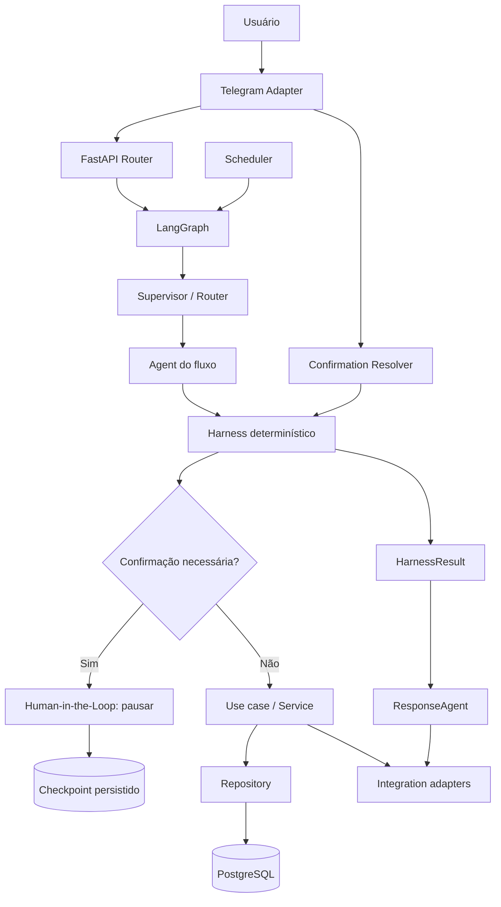

# SARA 2.0 — Arquitetura

## Visão geral

A SARA 2.0 será um modular monolith assíncrono com quatro responsabilidades centrais:

1. receber eventos e devolver respostas pelo canal de entrada;
2. manter o fluxo conversacional e o estado no LangGraph;
3. transformar linguagem natural em comandos estruturados por meio de agentes;
4. validar e executar comandos com regras determinísticas no Harness.



## Princípios

### O Graph orquestra; não contém regra de domínio

O LangGraph controla sequência, estado, pausa, retomada e transições. Regras como “uma tarefa precisa de título” ou “delete exige confirmação” pertencem ao domínio e ao Harness.

Depois de uma confirmação, o fluxo não volta ao Supervisor nem reinterpreta a intenção pelo agente. O evento de confirmação entra no `ConfirmationResolver`, que chama o Harness diretamente para validar a pendência e executar o comando. O LangGraph pode continuar sendo usado como mecanismo de checkpoint, mas a retomada deve ocorrer no nó determinístico de confirmação, nunca no início do workflow.

### O agente interpreta; não executa

Agentes produzem mensagens e comandos. Não criam `AsyncSession`, não chamam Telegram, não montam SQL e não escolhem sozinhos se uma operação de alto impacto pode prosseguir.

### O Harness é a única porta de mutação iniciada por agente

Qualquer comando recebido do Graph passa pelo Harness. Isso centraliza autorização, validação, confirmação, idempotência, transação e auditoria.

### O domínio não conhece integrações

Telegram, LLM, LangGraph, PostgreSQL e APScheduler são adapters. O domínio depende de interfaces pequenas e de resultados estruturados.

### Estado importante é durável

Fluxo ativo, confirmação pendente, comando recebido e resultado de execução não podem existir somente em memória. Locks locais podem existir como otimização, mas nunca como fonte de verdade.

## Módulos e responsabilidades

| Módulo | Responsabilidade | Não deve fazer |
| --- | --- | --- |
| `routers` | Validar transporte, autenticar entrada, criar contexto e encaminhar eventos. | Executar regra de tarefa ou decidir policy. |
| `schemas` | Definir contratos de entrada, saída, comandos e eventos. | Persistir ou chamar serviços externos. |
| `models` | Representar o modelo persistido e invariantes de armazenamento. | Interpretar linguagem natural. |
| `repositories` | Esconder consultas e comandos de persistência atrás de interfaces async. | Aplicar fluxo conversacional ou policy de confirmação. |
| `services` | Implementar casos de uso de tarefas, planejamento, revisão e lembretes. | Conhecer Telegram ou formato de prompt. |
| `agents` | Interpretar mensagens dentro de um fluxo e produzir `AgentDecision`. | Acessar banco, enviar mensagens ou executar comandos. |
| `graph` | Orquestrar Supervisor, agentes, Harness, pausa e retomada. | Duplicar regras dos serviços. |
| `harness` | Validar, autorizar, confirmar e executar comandos. | Decidir intenção por linguagem natural. |
| `ResponseAgent` | Interpretar o payload estruturado do Harness e produzir a resposta final ao usuário. | Inventar efeitos, autorizar comandos ou alterar dados. |
| `integrations` | Adaptar Telegram, LLM e outros provedores às interfaces internas. | Ser chamado diretamente pelos agentes. |
| `scheduler` | Disparar fluxos agendados de lembretes e revisão/planejamento. | Reimplementar casos de uso. |
| `db` | Criar engine async, `async_sessionmaker`, migrations e transações. | Ser importado por agentes. |
| `observability` | Logs estruturados, métricas e correlação de execução. | Alterar o resultado de uma operação. |

## Fluxo ativo e roteamento

O roteamento segue esta ordem:

```text
Evento recebido
  ├─ confirmação pendente? → ConfirmationHandler
  ├─ fluxo ativo? → agente registrado no fluxo
  ├─ cancelamento/troca explícita? → encerra fluxo → Supervisor
  └─ nenhum fluxo ativo → Supervisor → agente adequado
```

O Supervisor não deve ser executado novamente para toda mensagem de uma conversa ativa. Isso reduz trocas indevidas de contexto e mantém o diálogo coerente.

O fluxo persistido deve conter, no mínimo:

- `flow_id`;
- `user_id`;
- `flow_type`;
- `current_agent`;
- `graph_thread_id`;
- `status`;
- `context` estruturado;
- `expires_at`;
- timestamps.

## Contrato dos agentes

O contrato mínimo é independente do agente concreto:

```python
class AgentDecision(BaseModel):
    message: str | None = None
    command: Command | None = None
    transition: Transition | None = None
    metadata: dict[str, object] = {}
```

Um turno pode retornar apenas mensagem:

```json
{
  "message": "Qual horário você pretende usar?",
  "command": null,
  "transition": null,
  "metadata": {}
}
```

Ou propor execução:

```json
{
  "message": "Encontrei 4 tarefas para remanejar.",
  "command": {
    "type": "tasks.reschedule_many",
    "payload": {"task_ids": ["..."], "target_date": "2026-08-19"}
  },
  "transition": null,
  "metadata": {"reason": "daily_planning"}
}
```

O envelope não autoriza a execução. Ele é apenas a saída do agente para o Graph/Harness.

## ResponseAgent e resposta pós-execução

O `ResponseAgent` é o último módulo de interpretação do workflow. Ele recebe o `HarnessResult` estruturado depois de uma execução, confirmação, rejeição ou falha, e produz uma resposta clara para o usuário.

```python
class ResponseDecision(BaseModel):
    message: str
    transition: Transition | None = None
    metadata: dict[str, object] = {}
```

O input mínimo do `ResponseAgent` é:

```python
class HarnessResult:
    status: str
    command_type: str
    effect: dict[str, object] | None
    error_code: str | None
```

O agente pode usar linguagem natural para verbalizar o resultado, mas só pode afirmar efeitos presentes em `status` e `effect`. Deve existir um fallback determinístico para cada comando principal. Por exemplo, `tasks.create` informa que a tarefa foi criada, `tasks.delete` informa que a tarefa foi excluída e `tasks.update` informa quais atributos foram alterados.

O `ResponseAgent` não executa comandos, não chama repositories e não decide transições de segurança. Depois dele, o Graph apenas persiste a transição final e o adapter de canal envia a mensagem.

## Agentes da primeira versão

### `SupervisorAgent`

Classifica uma intenção inicial e seleciona o agente. Pode indicar cancelamento, troca explícita ou ausência de contexto. Não executa comandos.

### `TaskAgent`

Conduz captura, consulta, conclusão, edição, exclusão e remanejamento de tarefas fora do fluxo específico de planejamento.

Para concluir uma tarefa mencionada por descrição, o agente produz `tasks.complete` com
uma consulta textual. O Harness busca obrigatoriamente entre tarefas `active`: um
candidato é concluído, enquanto vários candidatos ficam pendentes para uma escolha
explícita do usuário. O Graph apenas armazena os candidatos e, depois da escolha,
encaminha um comando interno `tasks.complete_by_id` usando o ID devolvido pelo Harness.

### `PlanningAgent`

Conduz o planejamento de uma data-alvo, consolida escolhas e produz comandos de criação ou alteração em lote quando o usuário confirma o plano.

### `ReviewAgent`

Conduz a revisão diária: apresenta tarefas relevantes, registra concluídas, pendências e decisões de remanejamento.

### `ReminderAgent`

Conduz criação e consulta de lembretes vinculados a tarefas. O disparo temporal é responsabilidade do Scheduler e a entrega é responsabilidade do adapter de integração.

### `ResponseAgent`

Recebe o `HarnessResult` pós-execução e produz a resposta final. É um agente de verbalização grounded no payload do Harness, não uma nova etapa de autorização ou execução.

Os agentes podem compartilhar serviços de domínio, mas não devem compartilhar estado mutável implícito ou acessar uns aos outros diretamente.

## LangGraph

O Graph representa o ciclo de execução, não o domínio:

```text
START
  → load_session
  → resolve_confirmation_or_route
      ├─ confirmation_event → confirmation_resolver → harness_resolve
      ├─ active_flow → active_agent
      └─ no_active_flow → supervisor → selected_agent
  → normalize_decision
  → harness_validate
      ├─ awaiting_confirmation → pause
      ├─ rejected → response_agent
      ├─ failed → response_agent
      ├─ executed → response_agent
      └─ no_command → agent_message
  → persist_result_and_transition
  → send_response
END
```

Requisitos:

- usar estado tipado;
- persistir checkpoint por `graph_thread_id`;
- suportar pausa explícita durante Human-in-the-Loop;
- retomar callback no `confirmation_resolver`/Harness, sem passar pelo Supervisor;
- entregar todo `HarnessResult` pós-execução ao `ResponseAgent`;
- não depender de variáveis globais para saber qual agente está ativo;
- tornar cada nó testável por entradas e saídas estruturadas.

## Harness e seam de execução

O Harness é um módulo profundo: oferece uma interface pequena (`handle(command, context)`) e concentra validação, policy, transação, idempotência e auditoria.

```text
AgentDecision.command
        ↓
Command schema
        ↓
Authorization + scope
        ↓
Policy / confirmation
        ↓
Use case
        ↓
Repository + transaction
        ↓
HarnessResult com effect
        ↓
ResponseAgent
        ↓
Mensagem do canal
```

O adapter de banco é substituível por fake ou banco de teste na seam do repository. O adapter de Telegram é substituível por capturador de mensagens e callbacks. O `ResponseAgent` é testável com `HarnessResult` fabricado, sem banco, Graph ou Telegram.

## Scheduler

O Scheduler inicia fluxos, não executa regras duplicadas:

- busca lembretes vencidos;
- cria eventos de disparo idempotentes;
- inicia revisão ou planejamento quando configurado;
- entrega o evento ao Graph;
- envia o resultado pelo Integration adapter.

Cada job deve ser seguro para reexecução. A execução agendada deve usar chave idempotente baseada no recurso e na janela temporal.

## Transações e consistência

- Cada comando de mutação usa uma unidade transacional explícita.
- O serviço mantém a transação; o repository não faz `commit` escondido em cada método.
- A resposta ao usuário só é enviada depois do commit.
- Falhas externas após o commit devem produzir estado de entrega pendente ou retry, não repetir a mutação de domínio.
- Comandos com idempotency key retornam o resultado original quando reapresentados.

## Segurança e isolamento

- Todo comando recebe `user_id` do contexto autenticado, nunca do texto do usuário ou do LLM.
- Repositories filtram por `user_id` em toda leitura e mutação.
- Telegram valida secret do webhook e chat autorizado antes de criar evento.
- Confirmações são vinculadas a usuário, comando, alvo e expiração.
- Logs não devem expor tokens ou conteúdo completo sem necessidade.

## Decisões que não fazem parte da 2.0

Não introduzir nesta etapa microserviços, filas distribuídas, event sourcing, múltiplos provedores de LLM, RAG, calendário externo ou uma plataforma genérica de automações. A arquitetura mantém seams para evolução, mas implementa apenas o domínio de tarefas.
